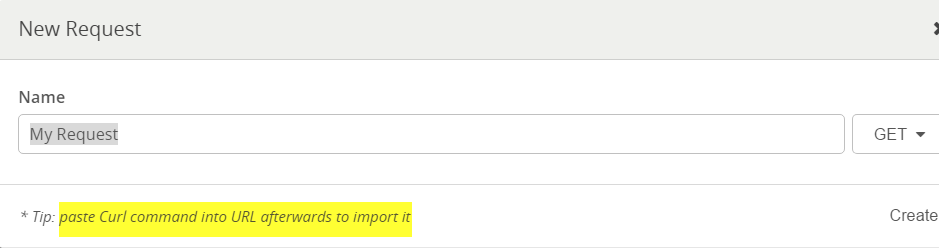
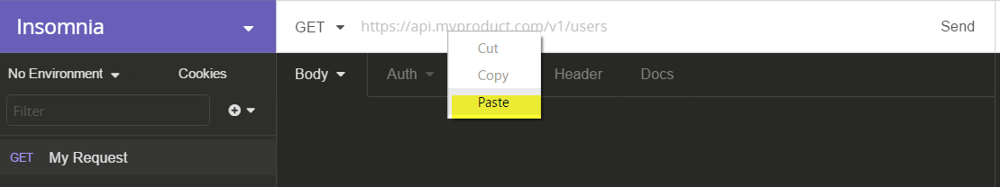

# OnlineWerkrooster APIs

## General

All APIs are built as a restful API which expect to receive data in JSON format accompanied with the correct Header information. Not only the data, but also the header information may differ between the different APIs! Please read the documentation carefully to make sure you are using the correct headers. If you have doubts or questions, you can contact the onlinewerkrooster.be support team (support@onlinewerkrooster.be).

You can use tools as Insomnia (https://insomnia.rest/) or Postman(https://www.getpostman.com/) in order to test the API. Per API you can find a "Curl" text which can easily use to copy/paste in your test tool without  entering all the information yourself manually.

## How to get access?

The API itself is public accessible for everyone, but to make sure the data is processed for the correct customer, the "requester" needs to identify himself by means of an API key, and User ID. These keys will be provided by the onlinewerkrooster.be team.  If you haven't received these keys yet, please contact support@onlinewerkrooster.be to receive this information so you can start using the API.

## API List

- Time Clock
  - [ETC Timeclock API](OwrApiETCTimeclock.md)
  - [ClockTime](OwrApiClockTime.md)
  - [ClockTimeSpecified](OwrApiClockTimeSpecified)

- Revenue
  - [BCMaticRevenue](OwrBCMaticRevenue.md)

    ​

